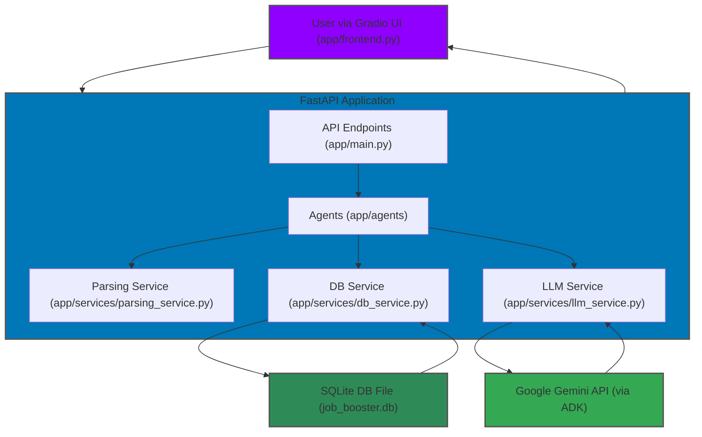

# 🚀 Job_Booster - Hackathon MVP (Refactored)

[] [] [] []

## Table of Contents

- [Overview](#overview)
- [Features](#features)
- [Architecture (MVP)](#architecture-mvp)
- [Tech Stack (MVP)](#tech-stack-mvp)
- [Getting Started](#getting-started)
- [Usage](#usage)
- [Project Structure](#project-structure)
- [Contributing](#contributing)
- [License](#license)

## Overview

Job_Booster aims to automate and significantly enhance the job application process by intelligently leveraging a user's entire work history. For the Hackathon MVP, it focuses on parsing resumes and job descriptions, and leveraging AI to tailor application materials.

This MVP is built as a **single, integrated FastAPI application with a Gradio UI** using **Google ADK with Google Gemini** for its AI capabilities. Note that the current code provides the foundational structure, with detailed logic being progressively developed during the hackathon.

## Features

(All features are being progressively developed)

- **Intelligent Document Parsing**: Extracts structured data from resumes (PDF, DOCX, TXT) and job descriptions using `app/services/parsing_service.py`.
- **AI-Powered Content Generation**: Utilizes Google Gemini via Google ADK (managed by `app/services/llm_service.py`) for tasks like resume tailoring and analysis.
- **Data Persistence**: Stores and retrieves parsed and generated data using an SQLite database, managed by `app/services/db_service.py`.
- **Vector Similarity**: Performs vector similarity search using vector indexes stored as files or within SQLite for quantitative match scoring.
- **Web Interface**: A simple Gradio UI (`app/frontend.py`) for user interaction.

## Architecture (MVP)

The Job_Booster MVP is a single FastAPI application that integrates all core functionalities:



Key components reside within the `app/` directory as detailed in section 2.1 of the Architecture document:
- `app/main.py`: The main FastAPI application, routing, and startup logic.
- `app/services/`: Contains `parsing_service.py`, `db_service.py`, and `llm_service.py`.
- `app/agents/`: Houses the agentic logic (e.g., `resume_tailor.py`).
- `app/models/`: Pydantic and SQLAlchemy models.
- `app/frontend.py`: Gradio user interface.

## Tech Stack (MVP)

- **Backend**: Python 3.9+, FastAPI
- **AI/LLM**: Google Gemini via Google ADK
- **Frontend**: Gradio
- **Database**: SQLite (with SQLAlchemy ORM)
- **Parsing**: PyPDF2, python-docx, pytesseract (for OCR), Pillow, pdf2image
- **Configuration**: Pydantic, python-dotenv
- **Logging**: Loguru

## Getting Started

### Prerequisites

- Python 3.9+
- Google Gemini API Key (obtainable from Google AI Studio or Google Cloud Console).
- (Optional) Virtual environment (`venv` or `conda`) for isolation.
- For PDF OCR: Tesseract OCR and Poppler utilities must be installed and in your system's PATH (see `3 - Implementation Details.md` for setup notes).

### Installation

```bash
# Clone the repo
git clone https://github.com/mozayed007/Job-Booster.git
cd Job-Booster

# Create virtual environment & install dependencies
python -m venv .venv

# On Windows
.venv\Scripts\activate

# On macOS/Linux
source .venv/bin/activate

# Install dependencies
pip install -r requirements.txt

# Set up environment variables
# Create a .env file in the project root with your Google Gemini API key:
echo "GOOGLE_GEMINI_API_KEY='your_api_key_here'" > .env
# Add other relevant environment variables as needed, e.g.:
# echo "GEMINI_MODEL='gemini-pro'" >> .env
echo "DATABASE_URL='sqlite:///./job_booster.db'" >> .env
echo "DEBUG=True" >> .env
echo "LOG_LEVEL=INFO" >> .env
```

### Launch the Application

```bash
# Start the FastAPI application with Uvicorn
python scripts/run_app.py 
# Alternatively, run directly: uvicorn app.main:app --reload --port 8000
```

This launches the FastAPI backend (default: <http://localhost:8000>) which also serves the Gradio UI (usually at the root `/` or a specific path like `/ui` depending on `app/main.py` configuration).

- FastAPI Swagger docs: <http://localhost:8000/docs>
- Gradio UI: <http://localhost:8000> (or specific path configured)

## Usage

The application provides a Gradio interface, typically accessible via the root URL of the FastAPI server once started. It will guide you through:

1. **Uploading/Pasting Resume**: Provide your resume as a file (PDF, DOCX, TXT).
2. **Pasting Job Description**: Input the job description text.
3. **Processing**: The backend agents and services will parse the documents, use Google Gemini for analysis and generation, and store results.
4. **Viewing Results**: The UI will display tailored content, analysis, or feedback.

### Sample Data

Sample files for testing can be found in the `data/` directory:

- `data/resumes/`
- `data/jobs/`

## Project Structure

```plaintext
Job_Booster/
├── app/                      # Main application package
│   ├── __init__.py
│   ├── agents/               # Agentic logic (e.g., resume tailoring)
│   │   ├── __init__.py
│   │   └── resume_tailor.py
│   ├── core/                 # Core utilities (e.g., config loading)
│   │   ├── __init__.py
│   │   └── config.py
│   ├── frontend.py           # Gradio UI application
│   ├── main.py               # FastAPI application entry point, API routers
│   ├── models/               # Pydantic API models, SQLAlchemy DB models
│   │   ├── __init__.py
│   │   ├── api_models.py
│   │   ├── base_model.py
│   │   ├── db_models.py
│   │   ├── job_model.py      # Specific model for job data
│   │   └── resume_model.py   # Specific model for resume data
│   ├── prompts/              # LLM prompt templates
│   │   └── ... 
│   └── services/             # Business logic services
│       ├── __init__.py
│       ├── db_service.py       # Database interactions
│       ├── llm_service.py      # LLM (Gemini via ADK) interactions
│       └── parsing_service.py  # Document parsing logic
├── data/
│   ├── jobs/
│   └── resumes/
├── outputs/                  # Directory for generated outputs (optional)
├── scripts/                  # Utility scripts (e.g., run_app.py)
│   └── run_app.py
├── tests/                    # Test suite
│   └── ...
├── 1 - Vision & Goals.md     # Project vision and goals (sections 1.1-1.3)
├── 2 - Architecture & structures.md # Architecture details (sections 2.1-2.4)
├── 3 - Implementation Details.md  # Implementation specifics (sections 3.1-3.3)
├── Hackathon_MVP_Plan.md     # MVP plan (in root)
├── .env.example              # Example environment file
├── .gitignore
├── LICENSE
├── README.md                 # This file
└── requirements.txt          # Python dependencies
```

## Contributing

Contributions are welcome! Please follow standard Git workflow (fork, branch, PR).

## License

This project is licensed under the MIT License - see the [LICENSE](LICENSE) file for details.
